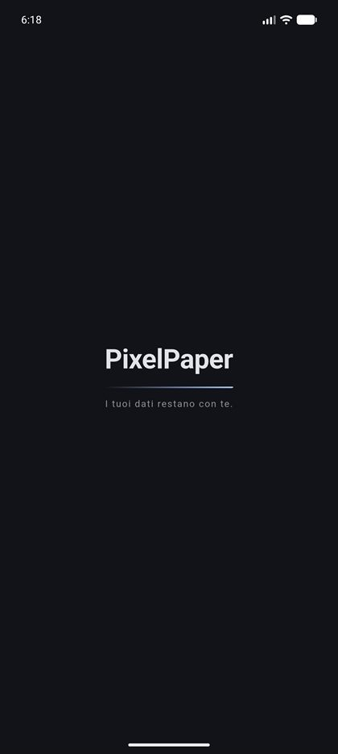
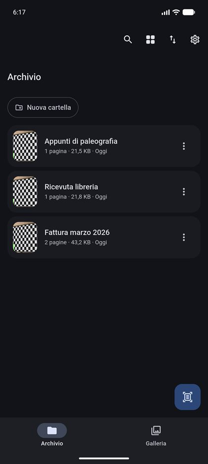
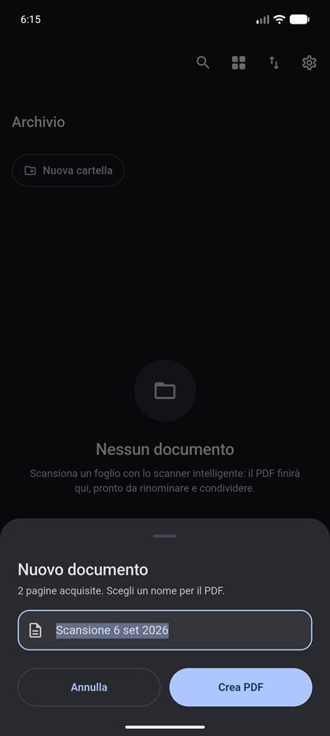
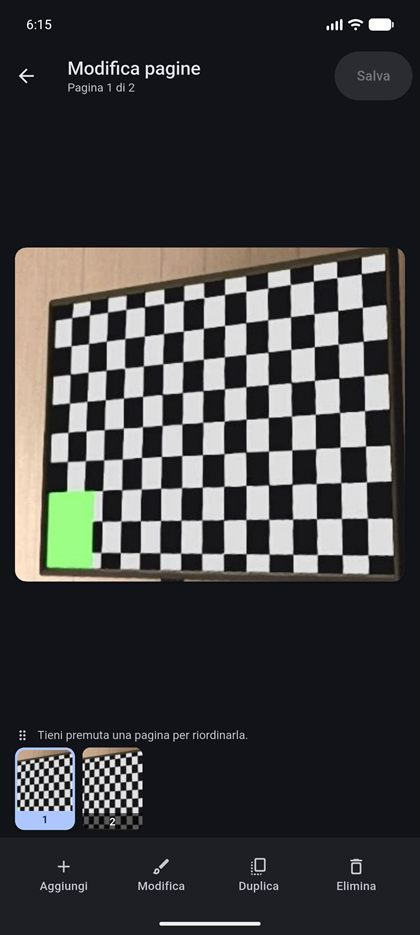
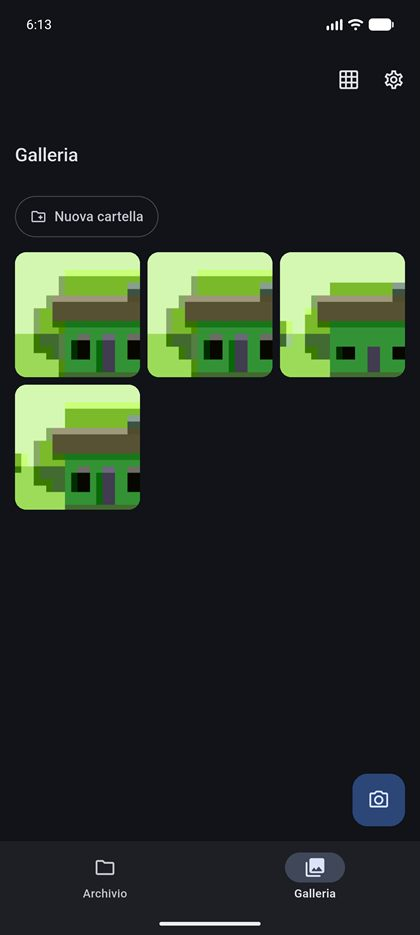
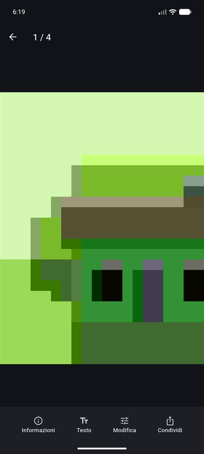
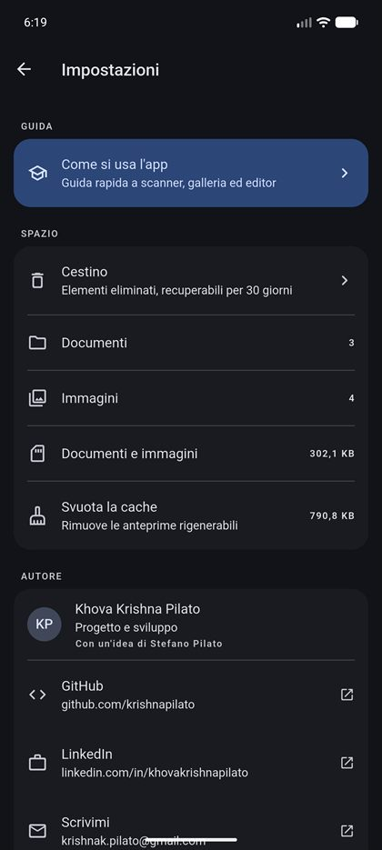

# PixelPaper

> **"I tuoi dati restano con te."** — *Your data stays with you.*

A document scanner and PDF archive for Android. Everything stays on the device:
no account, no cloud, no permission beyond the camera.

The interface is **Italian only** — a product decision, not an oversight; see
[Design decisions](#design-decisions).

**Author:** Khova Krishna Pilato ·
[GitHub](https://github.com/krishnapilato) ·
[LinkedIn](https://www.linkedin.com/in/khovakrishnapilato/) ·
[krishnak.pilato@gmail.com](mailto:krishnak.pilato@gmail.com)

<sub>From an idea by Stefano Pilato.</sub>

---

<table>
  <tr>
    <td align="center" width="25%">
      <br>
      <sub><b>Launch</b><br>The beam writes the name</sub>
    </td>
    <td align="center" width="25%">
      <br>
      <sub><b>Archive</b><br>Pages, size, date, folders</sub>
    </td>
    <td align="center" width="25%">
      <br>
      <sub><b>Naming</b><br>Asked after the scan</sub>
    </td>
    <td align="center" width="25%">
      <br>
      <sub><b>Viewer</b><br>One page at a time</sub>
    </td>
  </tr>
  <tr>
    <td align="center">
      <br>
      <sub><b>Page editor</b><br>Drag the filmstrip to reorder</sub>
    </td>
    <td align="center">
      <br>
      <sub><b>Gallery</b><br>Full-resolution shots</sub>
    </td>
    <td align="center">
      <br>
      <sub><b>Full screen</b><br>Details, text, edit, share</sub>
    </td>
    <td align="center">
      <br>
      <sub><b>Settings</b><br>Storage, bin, licences, author</sub>
    </td>
  </tr>
</table>

<sub>Screenshots taken on an Android 16 emulator, release build. The camera and
scanner ones show the emulator's virtual scene.</sub>

---

## What it does

| Module | What you get |
| :--- | :--- |
| **Smart scanner** | Google's ML Kit flow: edge detection, perspective correction, shadow cleanup, several pages in a row. The PDF comes out ready — you only pick the name. |
| **Camera and gallery** | Manual shots at full sensor resolution (`ResolutionPreset.max`), no automatic cropping, for old texts or fragile pages. Import from the system photo picker. Multi-select → share or build a PDF. |
| **Full-screen photo** | Zoom, swipe between shots, and four actions: details, text extraction (ML Kit, with copy and share), image editing and sharing. Nothing from the app covers the photo; swipe up or down to leave. |
| **PDF archive** | List or grid with thumbnail, page count, size and date. Search, sorting, rename, share, print, details. |
| **Viewer** | One page at a time, with zoom. |
| **Page editor** | Horizontal paging with the whole page on screen, a filmstrip above the dock for drag-and-drop reordering, and four actions: add, **edit the page as an image** (crop, rotate, draw, annotate), duplicate, delete. The PDF is recompiled in an isolate. |
| **Folders** | One level of folders for documents and for images, moved by dragging or from the "Sposta in" (move to) menu. The folder rail stays pinned while you scroll. |
| **Bin** | Deletion is reversible for 30 days, with immediate undo; deleting for good removes the files from storage. |
| **Guide and licences** | A seven-step in-app tutorial with code-drawn illustrations and three practical tips per step, plus the full list of technologies used with their open-source licences. |
| **Launch** | A four-second opening screen where the scanner beam "writes" the app's name, while the archive and gallery load underneath. One tap skips it. |

---

## Design decisions

Every detail answers a concrete problem:

- **Dark theme only.** The app is used on paper under a lamp; a bright UI at
  night was the flaw that started the redesign. No switch to get wrong: depth
  comes from M3 tonal layers (`surfaceContainer*`), not from shadows.
- **Italian only.** Every string lives in `assets/lang.json`; no copy is written
  in the code. The parts Flutter draws itself (text selection menu, licence
  page) and the image editor, which ships in English, are translated too: an
  English screen inside an all-Italian app is the crack you notice most.
- **The PDF name is asked after the scan**, not before: until you have scanned,
  you do not yet know what you are saving.
- **One action button**, unlabelled, whose meaning follows the tab: Archive →
  scan, Gallery → camera.
- **Long press = select and drag.** Lift without moving and you are simply in
  selection mode; keep moving and you carry the whole selection. One gesture,
  two outcomes, as in Files and Photos.
- **The bin only appears while dragging**, in place of the navigation bar: the
  target is where the thumb already is, and it cannot be hit by accident.
- **Deleting asks nothing** (it is reversible, with undo in the snackbar);
  emptying the bin does ask, because that step does not come back.
- **Folders are flat.** A scan archive needs "Fatture", "Università",
  "Ricette" — a tree would add breadcrumbs and navigation without adding value.
  Deleting a folder does not delete the files.
- **The viewer turns one page at a time**: a scan is a set of discrete pages, so
  the page number is exact and every page keeps its own zoom.
- **The editor shows one whole page at a time** and you change it by swiping
  horizontally, like the viewer: you are working on the content, not on a grid
  of postage stamps. The strip above the dock is the map of the document — tap
  a thumbnail to jump to it, hold it to drag it elsewhere.
- **"Modifica" turns the page into an image.** A PDF cannot be rewritten as
  text, so the page is rasterised at ~190 dpi, opened in the image editor and
  put back in its slot: you can crop, rotate, draw on and redact a single page
  without touching the others. The price is that the page becomes an image
  (bigger file, text no longer selectable), which is why it is an explicit
  action and never something that happens on its own.
- **The folder rail stays pinned.** A filter that disappears as soon as you
  scroll is a filter you forget you turned on; it is also the drop target, so
  dragging no longer means scrolling back to the top.
- **A vertical swipe closes the full-screen photo.** The photo follows the
  finger and shrinks: the gesture shows where it is going before it commits, and
  if you stop halfway it springs back. While zoomed the gesture is off, because
  there dragging means panning the image.
- **"Svuota la cache" lights up by itself.** Above 20 MB the row turns tonal and
  explains that space can be freed: it asks for attention only when it has
  something to give back.
- **The icon is the app's name.** An A4 sheet whose corner comes away as pixels:
  paper turning into an image. It is a vector (adaptive and monochrome icon)
  and, from Android 12, also the system launch screen, on a dark background —
  no white flash before an all-dark app.
- **One gesture, two outcomes, never two recognisers.** Tiles do not handle the
  long press themselves: the `LongPressDraggable` wrapping them does. Two
  recognisers on the same pointer fight over the arena and the innermost one
  wins — that is exactly how drag-and-drop stops working.

---

## Performance and memory

- **No unbounded rasterising.** DPI is computed from the page's real geometry
  (`PdfService.dpiFor`): an outsized page can no longer allocate hundreds of MB
  and take the process down.
- **Lazy rendering, cached on disk.** Pages are drawn one at a time and cached
  under a key that includes the file's modification stamp: a document is never
  rendered twice. The cache caps itself at 64 MB.
- **Images decoded at the size they are drawn** (`cacheWidth`), with the image
  cache capped at 80 MB: hundreds of 12 MP photos stay inside the heap.
- **Heavy work off the UI thread**: composing and rewriting PDFs run in an
  isolate through `compute`.
- **No memory leaks**: every controller, `PageController`,
  `TextEditingController` and camera session is closed; the camera is also
  released when the app goes to the background.
- **Minimum permissions**: `CAMERA` only. `RECORD_AUDIO` and
  `READ_EXTERNAL_STORAGE`, which would arrive from plugins, are stripped from
  the manifest with `tools:node="remove"`.

---

## Architecture

Clean Architecture, feature-first:

```text
lib/
├── main.dart                 # bootstrap: edge-to-edge, locale, image cache
├── app.dart                  # MaterialApp.router + theme
├── core/                     # theme, spacing, router, strings, shared widgets
├── data/
│   ├── models/               # ScannedDocument, Capture, Folder
│   ├── local/                # sqflite: database and DAOs
│   ├── services/             # ML Kit scanner, PDF, OCR, file system
│   ├── repositories/         # documents, images, folders + bin
│   └── providers.dart        # composition root
└── features/
    ├── shell/ documents/ gallery/ camera/ scanner/
    ├── viewer/ editor/ folders/ trash/
    └── settings/ tutorial/ splash/
```

Every feature has `application/` (Riverpod controllers) and `presentation/`
(screens and widgets). The sqflite database is the source of truth for
metadata, the file system is the source of truth for what actually exists:
every read reconciles the two.

---

## Stack

| Area | Packages |
| :--- | :--- |
| State | `flutter_riverpod` 3 (no code generation) |
| Navigation | `go_router` 18 (every route declares its own transition) |
| Language | `flutter_localizations` (locale fixed to `it`) + `assets/lang.json` |
| Database | `sqflite` (schema v2, with migration) |
| Capture | `google_mlkit_document_scanner`, `camera`, `image_picker` |
| PDF | `pdf`, `printing`, `syncfusion_flutter_pdf` |
| Images | `pro_image_editor`, `google_mlkit_text_recognition` |
| Misc | `share_plus`, `url_launcher`, `intl`, `crypto`, `package_info_plus` |

---

## Build requirements

| | Version |
| :--- | :--- |
| Flutter / Dart | 3.47.2 / 3.13.2 |
| Gradle | 9.1.0 |
| Android Gradle Plugin | 9.0.1 |
| Kotlin | 2.3.20 (AGP's built-in Kotlin) |
| JDK | 17 (`sourceCompatibility`/`jvmTarget`), built on JDK 21 |
| compileSdk / targetSdk / minSdk | 36 / 36 / 24 |

`compileSdk 36` is required by `google_mlkit_document_scanner` 0.6.x. The
scanner only works on Android devices with Google Play services: without them
the app says so and offers the manual camera instead.

```bash
flutter pub get
flutter run                 # debug on the connected device
flutter test                # page order after a save
flutter build apk --release # without key.properties it signs with the debug key
```

`flutter analyze` reports no issues and the Gradle build emits no warnings.

### Two things a release build can break silently

Both were found by testing the release APK on a device, and neither shows up in
debug — test the release build before every upload.

- **R8 and ML Kit.** ML Kit and Play Services resolve implementations *by name*
  at runtime, so R8 renaming them makes the lookup return null: the scanner and
  text extraction die with a `NullPointerException` thrown from inside
  `Objects.requireNonNull`, far from the cause. `proguard-rules.pro` keeps
  `com.google.mlkit.**`, `com.google.android.gms.**` and the plugins' bridge
  classes, plus the annotation and signature attributes those libraries read
  back.
- **`uses-feature` and the manifest merger.** `camera_android_camerax` declares
  `android.hardware.camera.any` as `required="true"`, and the merger ORs that
  value with ours, so the app shipped as "camera required" and Play dropped
  every camera-less device. The manifest now declares camera, camera.any and
  camera.autofocus as not required with `tools:replace="android:required"`.
  Check the merged result, not the source:

  ```bash
  grep -A2 uses-feature build/app/intermediates/merged_manifests/release/processReleaseManifest/AndroidManifest.xml
  ```

---

## Publishing to Google Play

1. **Create the signing key** (once, and keep it: without it you can never
   publish an update again).

   ```bash
   keytool -genkey -v -keystore pixelpaper.jks -keyalg RSA -keysize 2048 -validity 10000 -alias pixelpaper
   ```

2. **Declare it in `android/key.properties`** — the file is in `.gitignore`
   along with `*.jks`, so the key and its passwords never reach GitHub:

   ```properties
   storeFile=C:/absolute/path/pixelpaper.jks
   storePassword=…
   keyAlias=pixelpaper
   keyPassword=…
   ```

3. **Build the bundle** you upload to the Play Console:

   ```bash
   flutter build appbundle --release
   ```

   The artefact lands in `build/app/outputs/bundle/release/app-release.aab`.
   Without `key.properties` the bundle build **fails on purpose**: a
   debug-signed bundle installs and builds fine and is rejected only at the end
   of the upload ("signed with the wrong key"), so it is better refused here.
   A release *APK* still falls back to the debug key, because a locally signed
   APK is genuinely useful.

   Check what you are about to upload before you upload it:

   ```bash
   keytool -printcert -jarfile build/app/outputs/bundle/release/app-release.aab
   ```

   The SHA1 must match the upload certificate Play shows under
   *Release → Setup → App signing*.

   > `key.properties` is untracked, so a **git worktree does not inherit it**.
   > Build from the main checkout, or copy the file into the worktree's
   > `android/` first.

4. **Version number**: the `version:` line in `pubspec.yaml`, in the form
   `<versionName>+<versionCode>`. The number after the `+` is the
   `versionCode` and must be higher than every code already uploaded, or Play
   rejects the bundle before it looks at anything else.

The `applicationId` is `com.khovakrishnapilato.pixelpaper`. The bundle carries
every ABI: the actual per-device download is a fraction of its size.

---

## Editing the guide

The user guide at
[krishnapilato.github.io/pixelpaper](https://krishnapilato.github.io/pixelpaper/)
lives in `web/`: `index.html`, `styles.css`, `favicon.svg`. Plain HTML and CSS,
no framework, no build step — which is the point: a page you can fix in thirty
seconds is a page that stays accurate.

Editing it is a commit. `.github/workflows/deploy.yml` watches `web/**` on
`main` and publishes the folder as it is, so a change is live about half a
minute after it lands — from your editor or straight from GitHub's web editor,
without touching anything else in the repository. `workflow_dispatch` re-runs
the deploy by hand when you need it.

```bash
# preview before pushing: open the file, or serve the folder
start web/index.html
```

Two things worth keeping true: paths inside the page stay **relative**
(`styles.css`, not `/styles.css`), because the site is served from
`/pixelpaper/` and an absolute path would 404; and the CSS carries the
breakpoints, so check a change at both a phone width and a desktop one before
committing.

Pages must be set to **Settings → Pages → Source: GitHub Actions** for any of
this to publish.

---

## Text recognition

Text extraction uses ML Kit's **Latin** model: it recognises a *script*, not a
language, so it reads anything printed in the Latin alphabet — Italian,
English, French, and Latin itself. Greek (ancient or modern), Cyrillic, Hebrew
and Arabic are not supported, because ML Kit only ships Latin, Chinese,
Devanagari, Japanese and Korean models.

The practical limit is the printing, not the language: modern type reads well,
while blackletter/Fraktur, incunabula, long s (ſ), scribal abbreviations and
handwriting give poor results, and macrons (ā ē) are usually dropped. That is
why the gallery keeps shots at full resolution and uncropped: OCR always works
on the sharpest original available.
